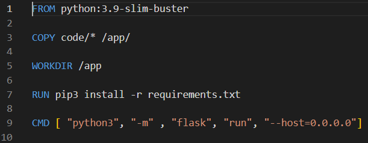

# https://app.zefirnikolov.com

This is the **web** part **microservice** of the **Kubernetes Cluster** deployed on **Amazon Web Services – AWS**. This part is intended for development team + **Dockerfile** and **Jenkinsfile** are intended for the **DevOps** -> Please see the whole cluster on **https://github.com/zefirnikolov/awsapp-k8scluster**

Code folder consists of 4 files:
1. **app.dat** -> It is intended for the Build variable at the bottom of the front end of the website.
2. **app.py** -> This is the backend of the website. It is made on **Flask web framework**  -> It connects to the **MariaDB database microservice** ( **https://github.com/zefirnikolov/awsapp-dbpart**  ) and pulls the stored random text from it.  The text is generated from the generator - **https://github.com/zefirnikolov/awsapp-genpart**.  Part of the code:

3. **app.tpl** -> This the frontend of the website. It is the **HTML/CSS** which shows the complete website. Part of the code:

4. **requirements.txt** -> this file is created in support for the Dockerfile. It is describing which python libraries should be installed with the Python docker image. 

The **Dockerfile**:
Downloads the main **Docker image**: **python:3.9-slim-buster** -> copy the Code folder into the image -> installs the python libraries in requirements.txt file -> opens and runs the **Flask web framework** as the main process of the container.

The **Jenkinsfile**:
Clones the **git repository** -> creates a **docker image** from the **Dockerfile** -> Push the image with **Updated TAG** to **Docker Hub** -> triggers the **second Jenkins job responsible** for the cluster repository.

The Jenkins job is with configured webhook - any time a change is made from this repository - It automatically builds this job using the Jenkinsfile.
